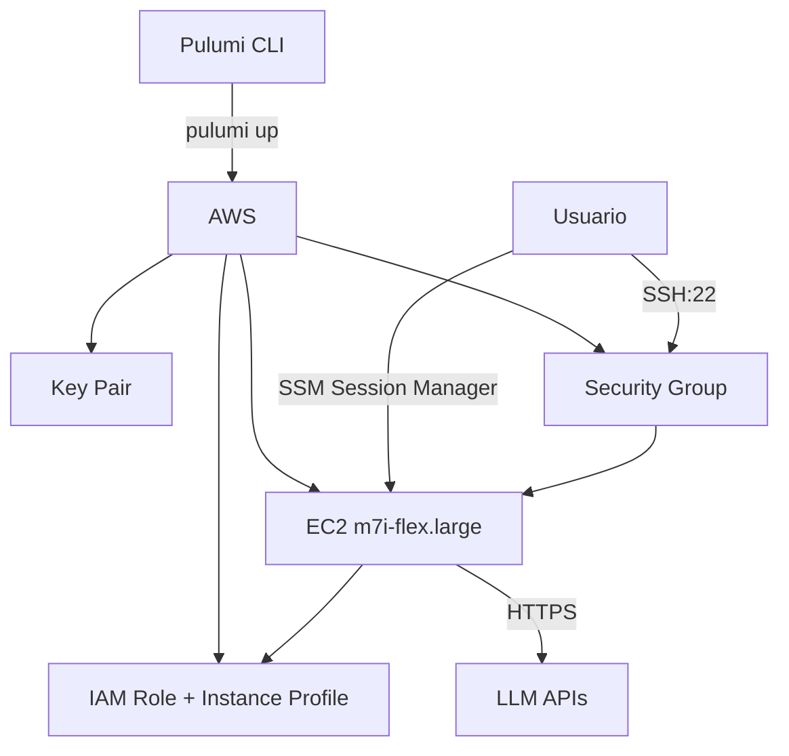

# Design Document: OpenClaw EC2 Deployment

## Overview

Despliegue de un agente OpenClaw en una instancia EC2 usando Pulumi (Python) como IaC. OpenClaw es un proyecto Node.js que requiere Node.js 22+ y ~8GB RAM para compilar, por lo que usamos `m7i-flex.large` (elegible para Free Tier en cuentas nuevas creadas después de julio 2025).

## Arquitectura



## Componentes

### 1. Key Pair

Par de claves SSH generado con TLS provider de Pulumi (RSA 4096 bits).

### 2. Security Group

| Tipo | Puerto | Origen | Descripción |
|------|--------|--------|-------------|
| Inbound | 22 | Tu IP/32 | SSH |
| Outbound | 443 | 0.0.0.0/0 | HTTPS para APIs y SSM |
| Outbound | 80 | 0.0.0.0/0 | HTTP para apt-get |

### 3. IAM Role + Instance Profile

Permisos:
- CloudWatch Logs (logs:CreateLogGroup, CreateLogStream, PutLogEvents)
- SSM Session Manager (AmazonSSMManagedInstanceCore)

### 4. EC2 Instance

| Parámetro | Valor |
|-----------|-------|
| Tipo | m7i-flex.large (8GB RAM) |
| AMI | Ubuntu 22.04 LTS |
| Volumen | 30GB gp3 |
| Key Pair | openclaw-key |

## Requisitos de OpenClaw

OpenClaw es un proyecto Node.js (no Python) que requiere:
- Node.js 22+ (versión mínima requerida)
- pnpm (gestor de paquetes)
- ~8GB RAM para compilar las dependencias
- Git para clonar el repositorio

## User Data Script

El script de instalación automática realiza:

1. Actualiza el sistema (apt update/upgrade)
2. Instala Node.js 22 desde NodeSource
3. Instala pnpm globalmente
4. Crea usuario `openclaw`
5. Clona repositorio de OpenClaw
6. Ejecuta `pnpm install` y `pnpm build`
7. Crea archivo de configuración en `~/.openclaw/.env`
8. Crea servicio systemd

## Configuración de OpenClaw

Archivo: `/home/openclaw/.openclaw/.env`

```bash
# Token de autenticación (generado automáticamente)
OPENCLAW_GATEWAY_TOKEN=<random-hex-32>

# API Keys - Configurar al menos una:
# OPENAI_API_KEY=sk-...
# ANTHROPIC_API_KEY=sk-ant-...
# GEMINI_API_KEY=...
# OPENROUTER_API_KEY=sk-or-...
```

## Comandos de Operación

### Despliegue

```bash
cd openclaw-infra-py
source venv/bin/activate
pip install -r requirements.txt

pulumi stack init dev
pulumi config set myIp $(curl -s https://checkip.amazonaws.com)
pulumi config set awsProfile <tu-profile>

AWS_PROFILE=<tu-profile> PULUMI_CONFIG_PASSPHRASE="" pulumi up
```

### Guardar clave SSH

```bash
pulumi stack output private_key_pem --show-secrets > openclaw-key.pem
chmod 400 openclaw-key.pem
```

### Conectar y configurar API key

```bash
ssh -i openclaw-key.pem ubuntu@$(pulumi stack output public_ip)

# En la instancia:
sudo nano /home/openclaw/.openclaw/.env
# Descomenta y agrega tu API key

sudo systemctl start openclaw
sudo systemctl status openclaw
```

### Ver logs de instalación

```bash
sudo cat /var/log/openclaw-install.log
```

### Ver logs del servicio

```bash
journalctl -u openclaw -f
```

## Limpieza

```bash
AWS_PROFILE=<tu-profile> PULUMI_CONFIG_PASSPHRASE="" pulumi destroy
rm openclaw-key.pem
```

## Free Tier - Cuentas Nuevas (post julio 2025)

Para cuentas AWS creadas después del 15 de julio de 2025, el Free Tier incluye:
- t3.micro, t3.small (2GB RAM)
- t4g.micro, t4g.small (2GB RAM, ARM)
- c7i-flex.large (4GB RAM)
- m7i-flex.large (8GB RAM) ← Usamos esta

## Estructura del Proyecto

```
openclaw-agent-easy-deploy/
├── README.md                                    # Guía principal de despliegue
├── CONTEXT.md                                   # Contexto para retomar sesiones
├── CONTRIBUTING.md                              # Guía de contribución
├── SECURITY.md                                  # Política de seguridad
├── LICENSE                                      # Licencia MIT
├── openclaw-config/                             # Configuración de OpenClaw
│   ├── openclaw.env.example                     # Template de variables de entorno
│   ├── openclaw.json.example                    # Template de config del gateway
│   └── openclaw.env                             # Config real (NO versionado)
└── openclaw-infraestructure/                    # Infraestructura
    ├── docker/                                  # Despliegue con Docker
    │   ├── Dockerfile
    │   └── docker-compose.yml
    └── iac-aws/                                 # AWS con Pulumi (Python)
        ├── __main__.py                          # Código Pulumi
        ├── Pulumi.yaml                          # Config del proyecto
        ├── Pulumi.dev.yaml.example              # Ejemplo de config del stack
        ├── requirements.txt                     # Dependencias Python
        ├── README.md                            # Instrucciones detalladas
        └── scripts/
            └── install-openclaw.sh              # Script de instalación manual
```
